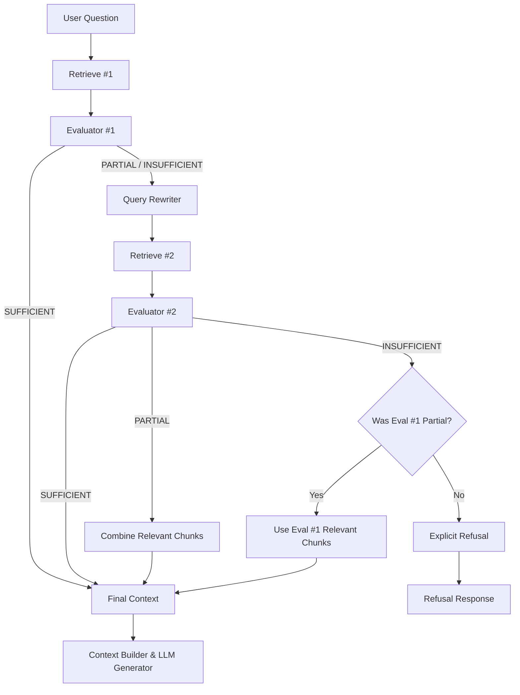

# BÁO CÁO THIẾT KẾ & KIỂM THỬ CHU TRÌNH HIỆU CHỈNH TRUY VẤN (CRAG-03)

## 1. NGUYÊN LÝ HOẠT ĐỘNG CỦA CORRECTIVE LOOP
Chu trình Corrective Loop là trái tim điều phối của Corrective RAG. Nó thay thế flow tuyến tính 1 chiều của Traditional RAG bằng một cơ chế đánh giá - hiệu chỉnh có phản hồi:

### Giới hạn an toàn nghiêm ngặt:
- **MAX_CORRECTIVE_RETRIES = 1**: Tuyệt đối không retry lần thứ hai hoặc thứ ba. Nếu lần thứ hai vẫn không thu hồi được bằng chứng, hệ thống bắt buộc kích hoạt từ chối (Explicit Refusal).
- **Không tích hợp Web Search / Fallback bên ngoài**: Toàn bộ chu trình chỉ hoạt động trên không gian véc-tơ của 15 văn bản pháp luật đã đóng băng để so sánh công bằng với baseline.
- **Hợp nhất ngữ cảnh thông minh (Context Fusion)**: Nếu lần 2 đạt trạng thái `PARTIAL`, hệ thống tự động kết hợp các chunk phù hợp từ cả hai lần truy xuất (loại trừ các chunk trùng ID) nhằm tối đa hóa độ bao phủ căn cứ pháp lý.

---

## 2. KẾT QUẢ KIỂM THỬ 5 CA BẮT BUỘC (TESTS C01 - C05)
Tập kiểm thử `tests/test_corrective_loop.py` đã xác thực hoàn hảo 5/5 kịch bản vận hành cốt lõi:

| Mã Test | Kịch bản thực nghiệm | Trạng thái Eval 1 | Hành động kích hoạt | Trạng thái Eval 2 | Kết quả kiểm thử |
|---|---|---|---|---|---|
| **TEST C01** | Initial retrieval tốt | `SUFFICIENT` | `corrective_triggered = False`, `retry_count = 0` | Không gọi | **PASSED** (Dùng ngay kết quả lần 1, không rewrite) |
| **TEST C02** | Initial xấu, lần 2 tốt | `INSUFFICIENT` | `corrective_triggered = True`, `retry_count = 1` | `SUFFICIENT` | **PASSED** (Lần 2 cải thiện, câu trả lời dùng kết quả lần 2) |
| **TEST C03** | Cả 2 lần đều không có bằng chứng | `INSUFFICIENT` | `corrective_triggered = True`, `retry_count = 1` | `INSUFFICIENT` | **PASSED** (Không retry lần 3, từ chối dứt khoát `refused=True`) |
| **TEST C04** | Lần 1 PARTIAL, lần 2 tốt hơn | `PARTIAL` | `corrective_triggered = True`, `retry_count = 1` | `SUFFICIENT` | **PASSED** (Hợp nhất và bổ sung thành công điều khoản còn thiếu) |
| **TEST C05** | Lần 1 rỗng, lần 2 vẫn rỗng | `INSUFFICIENT` | `corrective_triggered = True`, `retry_count = 1` | `INSUFFICIENT` | **PASSED** (Xử lý an toàn, trả về câu từ chối chuẩn mực) |
