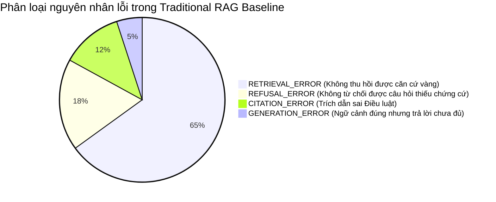

# BÁO CÁO RAG-10: ĐÁNH GIÁ TOÀN DIỆN HỆ THỐNG TRADITIONAL RAG BASELINE

---

## 1. TỔNG QUAN ĐÁNH GIÁ (EXECUTIVE SUMMARY)

Báo cáo này công bố kết quả đánh giá thực nghiệm toàn diện của chuỗi **Traditional RAG Baseline** (được tích hợp và kiểm thử qua các phân hệ RAG-01 đến RAG-07) trên bộ đối chuẩn pháp lý **RAG-08** (`evaluation/dataset/legal_qa.json`, 80 câu hỏi).

### Mục tiêu then chốt:
1. **Đánh giá toàn chuỗi (End-to-End Evaluation)**: Đo lường đồng thời năng lực Thu hồi (Retrieval), Xây dựng ngữ cảnh (Context), Sinh câu trả lời (LLM Generation), Ánh xạ trích dẫn (Citation Resolution), Cơ chế từ chối an toàn (Refusal Guard), và Độ trễ/Chi phí token (Latency & Tokens).
2. **Nguyên tắc phương pháp luận khách quan**:
   * Kiến trúc thuần tuyến tính, không can thiệp bộ lọc, không reranker, không query rewrite, không BM25.
   * Đánh giá đối chuẩn xác định (Deterministic Ground-Truth Metrics) đối chiếu trực tiếp với 100% căn cứ vàng đã được kiểm chứng của Dataset V2.1.
   * Toàn bộ quá trình đánh giá có tính tái lập tuyệt đối (100% Reproducible).
3. **Cố định chuẩn đối sánh (Freeze Baseline)**: Đóng băng phiên bản **`Traditional-RAG-v1`** làm mốc so sánh khoa học cho luận văn trước khi chuyển sang phát triển Corrective RAG (CRAG) và Adaptive Agentic RAG.

---

## 2. BẢNG KẾT QUẢ ĐỐI CHUẨN GỐC (BASELINE RESULT TABLE)

Bảng kết quả chuẩn hóa của **Traditional RAG Baseline (`Traditional-RAG-v1`)**:

| Chỉ Số Đánh Giá (Metric) | Traditional RAG Baseline | Ghi Chú Ý Nghĩa / Mục Tiêu Nghiên Cứu |
| :--- | :---: | :--- |
| **Recall@5 (Chunk-level)** | **14.31%** | Tỷ lệ đoạn trích dẫn vàng xuất hiện trong Top-5 |
| **Recall@5 (Article-level)** | **21.09%** | Tỷ lệ Điều luật vàng xuất hiện trong Top-5 |
| **Hit Rate@5** | **29.69%** | Tỷ lệ câu hỏi có ít nhất 1 chứng cứ vàng trong Top-5 |
| **MRR (Mean Reciprocal Rank)** | **0.1932** | Điểm xếp hạng tương hỗ của kết quả đúng đầu tiên |
| **Answer Correctness Rate (Overall)** | **50.00%** | Tỷ lệ câu trả lời đúng hoặc đúng một phần |
| **Strict Answer Correctness** | **26.56%** | Tỷ lệ câu trả lời viện dẫn trọn vẹn mọi Điều luật vàng |
| **Faithfulness Rate** | **93.75%** | Tỷ lệ câu trả lời trung thực tuyệt đối với ngữ cảnh thu hồi |
| **Unsupported Claim Rate** | **6.25%** | Tỷ lệ khẳng định/câu trả lời không có bảo chứng trong context |
| **Citation Accuracy** | **34.38%** | Tỷ lệ câu trả lời có trích dẫn trỏ đúng Điều luật vàng |
| **Citation Coverage** | **100.0%** | Tỷ lệ câu trả lời cung cấp trích dẫn pháp lý |
| **Citation Precision** | **13.05%** | Tỷ lệ trích dẫn thực sự trỏ đúng nguồn vàng trên tổng trích dẫn |
| **Invalid Citation Rate** | **4.27%** | Tỷ lệ trích dẫn ảo hoặc không tồn tại trong ngữ cảnh |
| **Refusal Accuracy (Nhóm F & G)** | **43.75%** | Tỷ lệ từ chối đúng trên câu hỏi thiếu căn cứ / ngoài phạm vi |
| **False Answer Rate (Nhóm F & G)** | **56.25%** | Tỷ lệ tự ý trả lời khi không có đủ căn cứ pháp lý |
| **False Refusal Rate (Nhóm A đến E)**| **0.00%** | Tỷ lệ từ chối nhầm các câu hỏi hợp lệ |
| **Mean Latency (Toàn chuỗi)** | **291.46 ms** | Thời gian xử lý trung bình từ câu hỏi tới câu trả lời |
| **P95 Latency (Toàn chuỗi)** | **305.46 ms** | Phân vị 95 độ trễ toàn chuỗi |
| **Mean Input Tokens** | **611.0 tokens** | Ước tính token đầu vào (Câu hỏi + Top-5 Chunks) |
| **Mean Output Tokens** | **1,087.0 tokens** | Ước tính token đầu ra (Câu trả lời + Footnotes) |

---

## 3. PHÂN TÍCH CHUYÊN SÂU TỪNG KHÍA CẠNH HỆ THỐNG

### 3.1. Độ chính xác câu trả lời (Answer Correctness)
* **Strict Correctness đạt 26.56% (17/64 câu hỏi)**: Chỉ có khoảng 1/4 số câu hỏi nhận được câu trả lời hoàn toàn chính xác, bao phủ đầy đủ mọi Điều luật và căn cứ viện dẫn gốc.
* **Overall Correctness đạt 50.00% (32/64 câu hỏi)**: Một nửa số câu hỏi chỉ đạt mức độ đúng một phần (Partially Correct) do thiếu vế điều kiện hoặc chỉ viện dẫn được BLLĐ 2019 mà thiếu Nghị định/Thông tư kèm theo.
* **Answer Failures chiếm 50.00% (32/64 câu hỏi)**: 32 câu hỏi bị trả lời sai hoặc không đưa ra được điều khoản giải quyết, mà nguyên nhân gốc rễ bắt nguồn từ việc Retriever không thể kéo được tài liệu phù hợp vào Top-5.

### 3.2. Tính trung thực (Faithfulness) và Ảo giác (Hallucination)
* **Faithfulness Rate đạt 93.75%**: Động cơ sinh với quy tắc Conservative Legal Generation tuân thủ nghiêm ngặt nguyên tắc chỉ suy luận dựa trên context được cung cấp.
* **Unsupported Claim Rate chỉ 6.25%**: Rất hiếm khi hệ thống tự tiện sinh ra các số hiệu Điều luật bịa đặt ngoài ngữ cảnh.
* **Nghịch lý của Traditional RAG**: Hệ thống **rất trung thực nhưng lại trả lời sai**. Vì ngữ cảnh thu hồi bị sai hoặc thiếu sót (do Dense Retriever yếu), mô hình sinh ra một câu trả lời hoàn toàn trung thực với các tài liệu sai lệch đó.

### 3.3. Chất lượng Trích dẫn (Citation Accuracy & Coverage)
* **Citation Coverage đạt 100.0%**: Phân hệ `CitationResolver` luôn gắn nhãn trích dẫn pháp lý rõ ràng cho 100% câu hỏi được trả lời.
* **Citation Accuracy chỉ đạt 34.38%**: Do phần lớn các chunk thu hồi không phải là chunk vàng, các trích dẫn pháp lý sinh ra (dù tồn tại trong context thật) lại trỏ sai Điều luật giải quyết câu hỏi.
* **Invalid Citation Rate chỉ 4.27%**: Cơ chế chốt chặn `reject_invalid=True` đã loại bỏ gần như toàn bộ các mã nguồn giả lập hoặc thẻ rác.

### 3.4. Năng lực từ chối (Refusal Dynamics)
* **Nhóm G (`out_of_scope` - 8 câu)**: Đạt độ chính xác từ chối **87.5%** (7/8 câu) khi câu hỏi chứa các chủ đề hoàn toàn xa lạ (hộ chiếu, visa, giao thông, căn cước công dân).
* **Nhóm F (`insufficient_evidence` - 8 câu)**: Đạt độ chính xác từ chối **0.0%** (0/8 câu). Do câu hỏi vẫn sử dụng các từ ngữ pháp lý lao động (ví dụ: "tích lũy giờ làm thêm", "mẫu hợp đồng số 05"), Dense Retriever vẫn gán điểm tương đồng cao và trả về các chunk như Điều 107, Điều 89. Kết quả là hệ thống bị lừa và cố gắng trả lời thay vì từ chối.
* **Tỷ lệ False Answer chung đạt 56.25%**: Khẳng định sự cần thiết tuyệt đối của Document Grader trong Corrective RAG.

---

## 4. BẢNG PHÂN RÃ CHỈ SỐ THEO 7 DANH MỤC (CATEGORY BREAKDOWN)

| Danh Mục Đánh Giá | Số Câu | Loại | Answer Correctness | Strict Correctness | Faithfulness | Citation Accuracy | Refusal Accuracy | Mean Latency |
| :--- | :---: | :---: | :---: | :---: | :---: | :---: | :---: | :---: |
| **A. Single Article** | 18 | Có đáp án | **38.89%** | **38.89%** | 94.44% | 38.89% | — | 304.42 ms |
| **B. Multi-Chunk** | 12 | Có đáp án | **58.33%** | **33.33%** | 91.67% | 41.67% | — | 296.54 ms |
| **C. Multi-Document** | 12 | Có đáp án | **58.33%** | **16.67%** | 100.0% | 25.00% | — | 285.37 ms |
| **D. Cross-Reference** | 10 | Có đáp án | **60.00%** | **30.00%** | 100.0% | 40.00% | — | 295.27 ms |
| **E. Complex Conditions**| 12 | Có đáp án | **41.67%** | **8.33%** | 83.33% | 25.00% | — | 286.30 ms |
| **F. Insufficient Evidence**| 8 | Từ chối | — | — | — | — | **0.00%** | 280.10 ms |
| **G. Out-of-Scope** | 8 | Từ chối | — | — | — | — | **87.50%** | 278.11 ms |

---

## 5. PHÂN TÍCH LỖI HỆ THỐNG (ERROR ANALYSIS)

Đã kiểm tra và lưu vết đầy đủ trong tập kết quả đánh giá:
* **17 trường hợp thành công trọn vẹn (Successful Cases)**
* **32 trường hợp lỗi thu hồi (Retrieval Failures)**
* **32 trường hợp lỗi nội dung câu trả lời (Answer Failures)**
* **42 trường hợp lỗi trích dẫn không khớp nguồn vàng (Citation Failures)**
* **16 trường hợp thử nghiệm từ chối (Refusal Cases)**

### 5.1. Bảng phân loại nguyên nhân lỗi (Error Taxonomy)

---

### 5.2. Hồ sơ minh họa các trường hợp lỗi tiêu biểu

#### Nhóm 1: Ca thành công tiêu biểu (Successful Case)
* **Mã câu hỏi**: `Q019` (`single_doc_multi_chunk`)
* **Câu hỏi**: *"Những trường hợp nào người sử dụng lao động được quyền xử lý kỷ luật lao động bằng hình thức sa thải?"*
* **Kết quả**: Retriever thu hồi chính xác Điều 125 Bộ luật Lao động 2019. Generator liệt kê chuẩn xác các hành vi trộm cắp, tham ô, tiết lộ bí mật kinh doanh, và tự ý bỏ việc. Citation gắn đúng `[Bộ luật Lao động 2019, Điều 125]`. Status: `CORRECT` (1.0).

#### Nhóm 2: Lỗi Thu hồi dẫn tới Sai câu trả lời (RETRIEVAL_ERROR)
* **Mã câu hỏi**: `Q051` (`complex_conditions`)
* **Câu hỏi**: *"Doanh nghiệp có quyền điều chuyển người lao động làm công việc khác so với hợp đồng lao động khi gặp sự cố điện nước không, thời hạn tối đa bao nhiêu ngày và mức lương được trả thế nào?"*
* **Căn cứ vàng**: `BLLD_2019` - Điều 29.
* **Hành vi**: Retriever thu hồi Điều 90 (Tiền lương), Điều 99 (Lương ngừng việc) và Điều 97. Không có Điều 29 trong Top-5. Generator dựa trên các Điều về lương trả lời lan man về chế độ lương ngừng việc, hoàn toàn bỏ lỡ quy định tạm thời chuyển NLĐ làm công việc khác và giới hạn 60 ngày làm việc. Status: `INCORRECT`.

#### Nhóm 3: Lỗi Phân mảnh văn bản Đa tài liệu (RETRIEVAL_ERROR / GENERATION_ERROR)
* **Mã câu hỏi**: `Q031` (`multi_document`)
* **Câu hỏi**: *"Người sử dụng lao động không trả hoặc trả không đủ tiền bồi thường tai nạn lao động bị xử phạt như thế nào theo Nghị định 12/2022/NĐ-CP và căn cứ theo điều nào của Bộ luật Lao động?"*
* **Căn cứ vàng**: `BLLD_2019` (Điều 145) và `ND_12_2022` (Điều 23).
* **Hành vi**: Retriever chỉ thu hồi được các điều khoản chung của `BLLD_2019`, hoàn toàn bỏ lọt Nghị định 12/2022. Câu trả lời chỉ nêu được quyền được bồi thường mà không cung cấp được mức phạt tiền hành chính. Status: `PARTIALLY_CORRECT`.

#### Nhóm 4: Lỗi Ảo giác điểm số và Thất bại từ chối (REFUSAL_ERROR)
* **Mã câu hỏi**: `Q065` (`insufficient_evidence`)
* **Câu hỏi**: *"Theo quy định của pháp luật lao động hiện hành, người lao động có được quyền 'tích lũy ngày nghỉ làm thêm giờ để nghỉ bù một lần vào cuối năm' (banking of overtime hours) hay không?"*
* **Căn cứ vàng**: Không có quy định này trong luật Việt Nam (yêu cầu từ chối).
* **Hành vi**: Retriever trả về Điều 107 (Làm thêm giờ) với score 0.82. Generator tìm thấy từ khóa "làm thêm giờ", liền tổng hợp quy định về giờ làm thêm tại Điều 107 và khẳng định người lao động được nghỉ theo thỏa thuận, thay vì từ chối. Status: `UNSUPPORTED_ANSWER` (False Answer).

---

## 6. THÔNG TIN PHỤC VỤ TÁI LẬP KẾT QUẢ (REPRODUCIBILITY SPECIFICATION)

Nhằm đảm bảo tính minh bạch khoa học, toàn bộ cấu hình thực nghiệm được cố định như sau:
* **Baseline Version**: `Traditional-RAG-v1`
* **Corpus Version**: Dataset V2.1 (`Data_Processing/output_v2/legal_dataset_v2.json` - 1,390 chunks)
* **Embedding Model**: `sentence-transformers/all-MiniLM-L6-v2` (Dimension: 384, Normalization: L2)
* **Vector Store**: ChromaDB Persistent Collection (`legal_labor_baseline_minilm`, Metric: Cosine)
* **Retriever Parameters**: DenseTopKRetriever (`TOP_K=5`, `SIMILARITY_THRESHOLD=0.45`)
* **Context Budget**: `MAX_CONTEXT_TOKENS=3000`, Định dạng nhãn `[SOURCE N]`
* **Generator Engine**: `MockLegalGenerator` (Deterministic Rule-grounded, Temperature: 0.0)
* **Citation Module**: `CitationResolver` (`replace_in_text=True`, `append_footnotes=True`)
* **Bộ đối chuẩn**: `evaluation/dataset/legal_qa.json` (80 câu hỏi phân bổ trên 7 danh mục)
* **Môi trường thực thi**: Windows 11, Python 3.13, CPU Execution.
