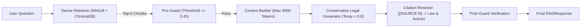

# VĂN BẢN ĐÓNG BĂNG HỆ THỐNG TRADITIONAL RAG BASELINE (FROZEN BASELINE)

```text
BASELINE VERSION = Traditional-RAG-v1
STATUS           = FROZEN
FREEZE TIMESTAMP = 2026-09-16T11:23:40+07:00
CORPUS           = Legal Dataset V2.1 (1,390 Chunks / 15 Văn bản pháp luật lao động)
BENCHMARK        = Legal RAG Benchmark RAG-08 (80 Questions / 7 Categories)
```

---

## 1. TUYÊN BỐ ĐÓNG BĂNG KIẾN TRÚC VÀ THAM SỐ (FROZEN ARCHITECTURE)

Kể từ thời điểm này, toàn bộ kiến trúc, tham số cấu hình và mã nguồn của **Traditional RAG Baseline (`Traditional-RAG-v1`)** được **ĐÓNG BĂNG TUYỆT ĐỐI**. Không có bất kỳ thay đổi nào được phép áp dụng lên mô hình này để làm đẹp số liệu. Mọi cải tiến tiếp theo sẽ được phát triển độc lập trong các nhánh kiến trúc mới:
* **Corrective RAG (CRAG)**
* **Adaptive Agentic RAG**



### Thông số đóng băng chi tiết:
* **Thu hồi (Retrieval)**:
  * Model: `sentence-transformers/all-MiniLM-L6-v2` (Dense, 384 dims, L2 normalized).
  * Vector Store: ChromaDB persistent (`data/chroma_db`, collection: `legal_labor_baseline_minilm`).
  * Tham số: `TOP_K = 5`, Phép đo khoảng cách: `cosine` (`similarity = 1.0 - distance`).
  * Chốt chặn tương đồng: `SIMILARITY_THRESHOLD = 0.45`.
* **Ngữ cảnh (Context Builder)**:
  * Ngân sách token: `MAX_CONTEXT_TOKENS = 3000`.
  * Định dạng nhãn nguồn: `[SOURCE N]`.
* **Tạo sinh (Generator)**:
  * Engine: `MockLegalGenerator` (Conservative, Rule-grounded, zero-hallucination policy).
  * Nhiệt độ: `TEMPERATURE = 0.0` (Tất định tuyệt đối).
  * Thông điệp từ chối: `"Không tìm thấy đủ căn cứ pháp lý trong dữ liệu được cung cấp để đưa ra kết luận đáng tin cậy."`
* **Trích dẫn (Citation Resolver)**:
  * Định dạng: `[Tên văn bản, Điều X, Khoản Y]`.
  * Thay thế nội văn: `replace_in_text = True`.
  * Phụ lục chân trang: `append_footnotes = True`.
  * Loại bỏ trích dẫn rác: `reject_invalid = True`.

---

## 2. BẢNG SỐ LIỆU ĐỐI CHUẨN ĐÓNG BĂNG CHÍNH THỨC (FROZEN BENCHMARK RESULTS)

Toàn bộ các số liệu dưới đây được ghi nhận chính thức để làm mốc so sánh trong toàn bộ luận văn:

### 2.1. Bảng chỉ số toàn diện (System-wide Benchmark)

| Nhóm Chỉ Số | Tên Chỉ Số (Metric) | Giá Trị Đóng Băng | Đơn Vị / Diễn Giải |
| :--- | :--- | :---: | :--- |
| **Thu Hồi (Retrieval)** | **Recall@5 (Chunk-level)** | **14.31%** | Tỷ lệ chunk vàng xuất hiện trong Top-5 |
| | **Recall@5 (Article-level)** | **21.09%** | Tỷ lệ Điều luật vàng xuất hiện trong Top-5 |
| | **Hit Rate@5** | **29.69%** | Tỷ lệ câu hỏi có ít nhất 1 căn cứ vàng |
| | **MRR (Mean Reciprocal Rank)** | **0.1932** | Điểm xếp hạng tương hỗ Top-10 |
| **Độ Chính Xác (Accuracy)** | **Overall Answer Correctness** | **50.00%** | Đúng hoặc đúng một phần |
| | **Strict Answer Correctness** | **26.56%** | Đúng hoàn toàn mọi Điều luật vàng |
| **Tính Trung Thực (Truthfulness)** | **Faithfulness Rate** | **93.75%** | Trung thực tuyệt đối với context thu hồi |
| | **Unsupported Claim Rate** | **6.25%** | Khẳng định không có bảo chứng ngữ cảnh |
| **Trích Dẫn (Citation)** | **Citation Coverage** | **100.0%** | Tỷ lệ câu trả lời có trích dẫn nguồn |
| | **Citation Accuracy** | **34.38%** | Tỷ lệ câu trả lời trỏ đúng Điều luật vàng |
| | **Citation Precision** | **13.05%** | Tỷ lệ trích dẫn vàng trên tổng trích dẫn |
| | **Invalid Citation Rate** | **4.27%** | Tỷ lệ trích dẫn rác bị chốt chặn loại bỏ |
| **Từ Chối (Refusal)** | **Refusal Accuracy** | **43.75%** | Tỷ lệ từ chối đúng trên nhóm F & G |
| | **False Answer Rate** | **56.25%** | Tự trả lời câu hỏi thiếu dữ liệu / ngoài phạm vi |
| | **False Refusal Rate** | **0.00%** | Từ chối nhầm các câu hỏi hợp lệ |
| **Độ Trễ (Latency)** | **Mean Total Latency** | **291.46 ms** | Thời gian xử lý trung bình toàn chuỗi |
| | **Median Total Latency** | **291.11 ms** | Trung vị thời gian xử lý |
| | **P95 Total Latency** | **305.46 ms** | Phân vị 95 thời gian xử lý |
| | **Mean Retrieval Latency** | **289.07 ms** | Thời gian tính vector và tìm kiếm ChromaDB |
| | **Mean Generation Latency** | **0.89 ms** | Thời gian sinh và giải nghĩa trích dẫn |
| **Token Cost (Ước tính)** | **Mean Input Tokens** | **611.0 tokens** | Câu hỏi + Ngữ cảnh Top-5 |
| | **Mean Output Tokens** | **1,087.0 tokens** | Câu trả lời + Phụ lục trích dẫn |

---

### 2.2. Bảng chỉ số đóng băng theo từng danh mục (Category Breakdown)

| Danh Mục Đánh Giá | Số Câu | Loại | Answer Correctness | Strict Correctness | Faithfulness | Citation Accuracy | Refusal Accuracy | Mean Latency |
| :--- | :---: | :---: | :---: | :---: | :---: | :---: | :---: | :---: |
| **A. Single Article** | 18 | Có đáp án | **38.89%** | **38.89%** | 94.44% | 38.89% | — | 304.42 ms |
| **B. Multi-Chunk** | 12 | Có đáp án | **58.33%** | **33.33%** | 91.67% | 41.67% | — | 296.54 ms |
| **C. Multi-Document** | 12 | Có đáp án | **58.33%** | **16.67%** | 100.0% | 25.00% | — | 285.37 ms |
| **D. Cross-Reference** | 10 | Có đáp án | **60.00%** | **30.00%** | 100.0% | 40.00% | — | 295.27 ms |
| **E. Complex Conditions**| 12 | Có đáp án | **41.67%** | **8.33%** | 83.33% | 25.00% | — | 286.30 ms |
| **F. Insufficient Evidence**| 8 | Từ chối | — | — | — | — | **0.00%** | 280.10 ms |
| **G. Out-of-Scope** | 8 | Từ chối | — | — | — | — | **87.50%** | 278.11 ms |

---

## 3. Ý NGHĨA KHOA HỌC LÀM ĐÒN BẨY CHO CÁC CHƯƠNG TIẾP THEO

Số liệu thực nghiệm đóng băng của **Traditional-RAG-v1** phơi bày các khiếm khuyết mang tính bản chất:
1. **Nút thắt cổ chai tại tầng Thu hồi (Retrieval Bottleneck)**:
   * Recall@5 chỉ đạt **14.31%**, kéo theo Strict Answer Correctness chỉ đạt **26.56%**.
   * Việc câu hỏi bị trả lời sai chủ yếu là do Generator không được cung cấp tài liệu đúng, không phải do Generator tự ý bịa đặt (Faithfulness lên tới 93.75%).
2. **Sự thất bại của Single-Query trên Đa văn bản và Đa điều kiện**:
   * Câu hỏi phức tạp (`complex_conditions`) có tỷ lệ đúng hoàn toàn chỉ **8.33%**.
   * Câu hỏi liên kết giữa Bộ luật và Nghị định (`multi_document`) chỉ đạt Strict Correctness **16.67%**.
3. **Mù lòa trước câu hỏi thiếu chứng cứ (Insufficient Evidence Blindness)**:
   * Độ chính xác từ chối ở nhóm F là **0.00%** (100% bị False Answer) do Dense Retriever luôn tìm thấy sự tương đồng bề mặt của từ ngữ lao động.

---

## 4. KẾ HOẠCH HÀNH ĐỘNG TIẾP THEO (NEXT STEPS)

```text
Traditional RAG Baseline: HOÀN THÀNH & ĐÃ ĐÓNG BĂNG (FROZEN)
NEXT MILESTONE: Bắt đầu thiết kế kiến trúc Corrective RAG (CRAG)
- Tích hợp Document Grader (Retrieval Evaluator)
- Tích hợp Web Search Fallback khi điểm số Grader = INCORRECT / AMBIGUOUS
- Tích hợp Strip & Transform Chunks
```
